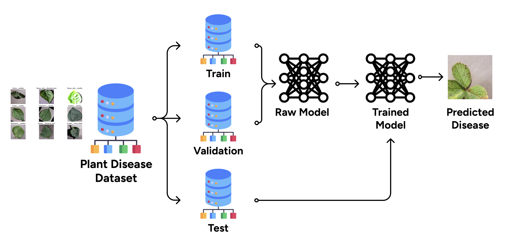
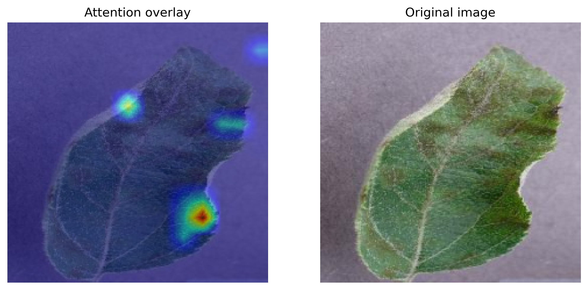

# Plant Disease Classification 🌿

This project focuses on building image classifiers to identify plant diseases. We experiment with several model architectures:

* Multi-Layer Perceptron
* Convolutional Neural Network
* Vision Transformer



# Environment Setup

1. Clone the repository:

```
git clone https://github.com/lolyhop/plant-disease-classification.git
cd plant-disease-classification
```

2. Install dependencies:

```
pip install -r requirements.txt
```

3. Download the dataset:

```
bash scripts/download_raw_data.sh
```

# Launch Experiments

## MLP

1. **Standard MLP**: Review and train with:

```
python train.py --config configs/mlp.yaml
```

2. **Deep MLP**: Review and train with:

```
python train.py --config configs/deep_mlp.yaml
```

3. Run inference:

```
python inference.py --config configs/mlp.yaml
```

## CNN

1. **ResNet**: Review and train with:

```
python train.py --config configs/resnet.yaml
```

You can modify `model_name` in the config to use `resnet18`, `resnet34`, `resnet50`, or `resnet101`.

2. **DenseNet**: Review and train with:

```
python train.py --config configs/densenet.yaml
```

You can modify `model_name` in the config to use `densenet121`, `densenet169`, or `densenet201`.

3. **EfficientNet**: Review and train with:

```
python train.py --config configs/efficientnet.yaml
```

You can modify `model_name` in the config to use `efficientnet_b0` through `efficientnet_b4`.

4. Run inference for any CNN model:

```
python inference.py --config configs/resnet.yaml
```

## Vision Transformer (ViT)

1. Review the configuration file:

```
configs/vit_2021.yaml
```

This file defines both the model architecture (number of layers, attention heads, etc.) and the training setup (batch size, learning rate, optimizer, etc.). Adjust parameters as needed.

2. Train the model:

```
python -m train --config configs/vit_2021.yaml
```

This command starts training using your configuration. The best model will be saved, and metrics will be logged to TensorBoard.

3. Run inference:

```
python -m inference --config configs/vit_2021.yaml
```

This will generate `predictions.csv` and `metrics.csv` in the logging directory.

# Insights

## ViT



The attention maps over image patches allow for interpretability, showing which regions the model focuses on when making predictions. This helps understand how the model "looks" at different parts of the plant image to identify diseases.


# Tech Stack

* Python
* PyTorch
* Albumentations
* Torchvision
